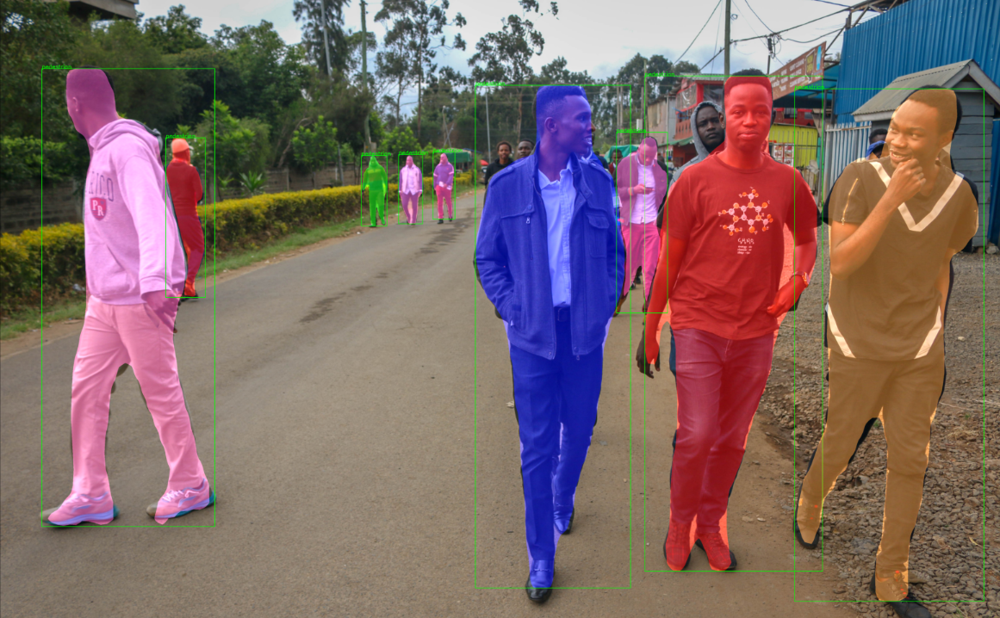

# Pedestrian Detection using Mask R-CNN



##  Overview
This project implements pedestrian detection using Mask R-CNN, a deep learning-based instance segmentation model. The goal is to accurately detect and segment pedestrians in images.

## Features
- Instance Segmentation: Identifies and outlines pedestrians.
- High Accuracy: Uses a fine-tuned Mask R-CNN model.
- Confidence Thresholding: Adjustable confidence levels for detections.
- Easy-to-Use API: Simple function calls for inference.


## Usage
### 1️. **Load the Model**
```python
import torch
from torchvision.models.detection import maskrcnn_resnet50_fpn
```
Load the trained model:
```
model = maskrcnn_resnet50_fpn(pretrained=True)
model.eval()
```

### 2️. **Run Inference on an Image**
```python
from utils import segment_instance

image_path = "path/to/your/image.jpg"
segment_instance(image_path, confidence=0.7)
```

### 3️. **Test with Your Own Images**
You can pass any image to the model and visualize the results:
```python
segment_instance("your_uploaded_image.jpg", confidence=0.5)
```

## Contact

For any questions or collaboration opportunities, feel free to reach out at [hey@njoguevans.me](mailto:hey@njoguevans.me).
